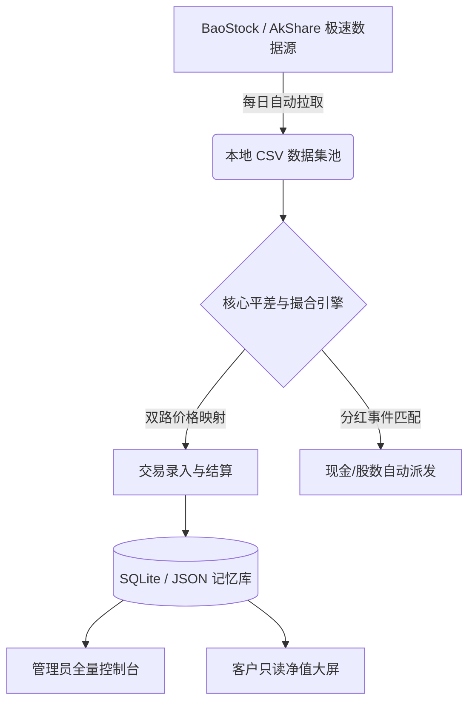

# 🌌 Nova Quant | 智能投顾与全周期资产管理中枢


> **"让代码处理繁琐，让大脑专注决策。"** > 本项目是一个基于 Python 和 Streamlit 开发的**生产级私募/专户投资管理控制台**。系统专为基金经理和投顾设计，内置业绩报酬核算引擎,能够实现毫秒级的精准记账，融合自动化除权息处理、双口径价格引擎与客户视角的丝滑大屏展示，以及极其严密的“管理端/客户端”双视角物理隔离架构。

---

## ✨ 核心硬核特性 (Core Features)

### 1. 🌊 智能高水位线业绩报酬引擎 (High-Water Mark Engine)
* **动态基数计算**：完美处理客户中途转入、提出资金的场景，严格按照真实净流入调整结算基数。
* **双轨制目标设定**：支持“按约定收益率(%)”或“手动指定目标总资产(¥)”双重模式，系统自动反推计算。
* **溢出利润无损截断**：当利润超过约定目标时，系统按目标比例精准扣费，并将超额利润无缝结转为下一期的起步本金。

### 2. 🛡️ 前后台物理隔离架构 (B/S Isolation)
- **👨‍💻 投顾/管理员模式**：拥有全量底牌视野。支持录入交易流水、动态添加追踪标的、查阅个股持仓数量与浮动盈亏，并内置流式富文本编辑器（Quill）撰写投顾报告。
- **🌐 客户/展示大屏模式**：通过加密专属 URL (`?user=xxx&acc=xxx`) 隐身降权访问。物理屏蔽具体持仓明细与操作面板，仅展示大类资产走势、超额收益（Alpha）、夏普比率及最大回撤等专业绩效指标。

### 3. 🧮 “时空平滑”双擎价格基准 (Dual-Engine Pricing)
彻底解决 A 股除权除息导致的“净值断层”痛点：
- **图表展示轴（前复权）**：自动抓取并对齐前复权数据，确保资金净值曲线如丝般顺滑，真实反映复合收益。
- **交易结算轴（不复权）**：智能剥离复权失真，录入台严格调用真实历史收盘价，确保结算总额与券商 APP 账单 100% 严丝合缝。

### 4. 💰 全自动法币分红派息引擎 (Auto-Dividend System)
告别手动查阅财报！系统内置深度爬虫，每日自动校验持仓标的的分红日历。一旦跨越除权除息日：
- **现金分红**：自动折算并“叮”声入账，充实账户可用现金储备。
- **送股/转增**：精准计算零碎股，自动增加底层持仓数量，全程零人工干预。

### 5. ⚡ UI/UX 黑科技与极致交互 (Extreme UX)
- **跨层穿透吸顶**：采用 JS 注入突破框架底层 DOM 限制，实现管理员控制台与客户大屏的“物理阻尼感”滚动吸顶特效。
- **智能交易录入台**：内置记忆逻辑（自动保留上次操作类型）、标的动态排序（最近操作过的资产自动置顶），支持交易日历智能屏蔽，大幅提升高频录入效率。
- **零延迟研报直出**：自定义 CSS 魔法翻译器，支持在原生编辑器中一键注入特定中英文字体与超链接。

---

## 🏗️ 系统架构与数据流 (Architecture)

---

## 🚀 极速部署 (Quick Start)

### 环境依赖

请确保本地已安装 Python 3.9 或以上版本。

```bash
# 1. 克隆本项目
git clone [https://github.com/Promistars/investment-advisor-manager-system.git](https://github.com/Promistars/investment-advisor-manager-system.git)
cd investment-advisor-manager-system

# 2. 安装依赖包
pip install -r requirements.txt

# 3. 启动后台数据增量同步引擎 (建议部署为每日 18:00 定时任务)
python auto_fetch.py

# 4. 启动可视化控制台
streamlit run app.py

```

---

## 📂 核心目录结构指南

```text
├── app.py                  # 系统大厅与登录鉴权网关
├── pages/
│   └── analytics.py        # 📈 投顾分析看板与核心撮合引擎 (Main Logic)
├── auto_fetch.py           # 🕷️ 全自动增量数据抓取脚本 (BaoStock/AkShare)
├── db_manager.py           # 💾 SQLite 数据库与 JSON 并行交互接口
├── financial_data/         # [系统生成] 个股双路历史 K 线库 (Git Ignore)
├── dividend_data/          # [系统生成] 历史除权除息事件库 (Git Ignore)
├── all_indices_data/       # [系统生成] 宽基指数对照库 (Git Ignore)
└── .gitignore              # 隐私数据与本地缓存隔离墙

```

---

## 💡 最佳实践与注意事项

1. **隐私安全**：所有的交易记录（`.db`）与配置清单（`.json`）均已加入 `.gitignore`，**不会上传至云端**，请放心在本地录入真实千万级实盘数据。
2. **动态添股**：遇到新开仓的股票，无需修改代码，直接在管理员侧边栏【➕ 动态添加新股票标的】中输入中文简称，系统将自动寻址并补齐 2023 年至今的所有 K 线与分红数据。
3. **客户展示**：点击控制台侧边栏【获取发送给客户的专属汇报链接】，配合 `Ngrok` 等内网穿透工具，即可生成带有鉴权参数的公网 URL，一键分发给客户（支持一键导出 PDF）。

---

*“在不确定性中寻找确定性，在复利中见证时间的玫瑰。”* —— 敬每一位严谨的交易者。
